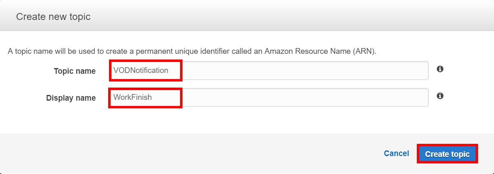

# Build a Video Converter and Video Streaming by Using AWS

**HLS** stands for **HTTP Live Streaming**, is a media streaming protocol for delivering visual and audio media to viewers over the internet.

**AWS Elemental MediaConvert** is a file-based video processing service that allows video providers with any size content library to easily and reliably transcode on-demand content for broadcast and multiscreen delivery. 

**Amazon CloudFront** is a web service that speeds up distribution of your static and dynamic web content, such as .html, .css, .js, and image files, to your users. CloudFront delivers your content through a worldwide network of data centers called edge locations. When a user requests content that you're serving with CloudFront, the user is routed to the edge location that provides the lowest latency (time delay), so that content is delivered with the best possible performance.


## Architecture


<p align = "center">
      
      </p>


## Scenario

If you are looking to encode only a couple of videos  to **HLS** playlist, you could consider converting all videos manually, but if you have a larger library, it is important to replace any manual steps with a good encoding way. **AWS Elemental MediaConvert** has all the important components you need to create a videos converting way.  

If you want to streaming your videos to global viewers, but afraid of some users may have latency to load your website or media, **Amazon CloudFront** can speed up the delivery of your static content. By using CloudFront, you can take advantage of the AWS backbone network and CloudFront edge servers to give your viewers a fast, safe, and reliable experience when they visit your website.

Also, it’s important to know is the encoding working or not, so you may like to recieve a notification about the result of the work by using **Amazon CloudWatch** and **Amazon Simple Notification Service(SNS)**.

## Pre-requisites
* An AWS account.
* Make sure the region is **US East (N. Virginia)**, which its short name is **us-east-1**.

## Lab tutorial

### Create two S3 buckets for videos

> NOTES: One for the video input, one for output.

1. On the Services menu, select **S3**.

2. Choose **Create Bucket**.

3. For the Bucket Name, type `video-input-firstname(e.g. video-input-jerry)`.

4. For the Region, choose **US East (N. Virginia)**. 

5. Choose **Create**.

<p align = "center">
      
      </p>

6. Repeat step 2~5 to create another bucket, but named it `video-output-firstname(e.g. video-output-jerry)`.

7. Search and open the bucket **video-input-firstname** that you created, and choose **Upload**, then upload **test1.mp4**, **test2.mp4** and **watermark.jpg** to the bucket.

### Create IAM role for MediaConvert

1. On the Services menu, select **IAM**.

2. Select **Roles** on the left navigation panel, choose **Create role**.

3. Choose **MediaConvert** for the services that will use this role, then choose **Next:Permissions**.

<p align = "center">
      
      </p>

4. For Attached permissions policies, choose **Next: Tags**, for Add tags(optional), choose **Next: Review**.

5. For **Role name**, type `vod-MediaConvertRole-firstname (e.g. vod-MediaConvertRole-jerry)`, then choose **Create role**.


6. Search and select `vod-MediaConvertRole-firstname` you created, copy the **Role ARN** to your notepad, we will use it later.


<p align = "center">
      
      </p>


### Start your video converting by MediaConvert

1. On the Services menu, select **MediaConvert**, then choose **Get started**.

<p align = "center">
      
      </p>

2. On Input 1, choose **Browse** and search for the bucket **video-input-firstname** that you created, and choose **test1.mp4** for the file.

3. On Video selector, find **Timecode source** and select **Start at 0**.

<p align = "center">
      
      </p>

4. Scroll down and find Input clips, select **Add input clip**, type `00:00:00:00` for Start timecode, type `00:00:07:00` for the End timecode.

<p align = "center">
      
      </p>

5. Scroll down and find Image inserter, select **Add image inserter**, for Image location, choose **Browse** to search the bucket **video-input-firstname** you created, and for File, select **watermark.jpg**.

6. Enter the following information as the following image :


<p align = "center">
      
      </p>


7. Choose **Add** to add another input, and for Input 2, choose **Browse** and search for the bucket **video-input-firstname** that you created, and choose **test2.mp4** for the file.


<p align = "center">
      
      </p>

8. Repeat step 5& 6 to **Add image inserter** for Input 2 too.


9. Find Output groups on the left navigation panel, choose **Add**, check the **File group** box, then choose **select**.

10. For Custom group name, type **MP4**, for **Destination**, search for the bucket **video-output-firstname** and add `/assets/test/mp4` after the path.

<p align = "center">
      
      </p>

11. Select **Output 1** on the left navigation panel to set up the Encoding settings, for **Resolution(w x h)**, type `1280` and `720`.

12. Scroll down and find **Bitrate (bits/s)**, type `3000000`.

13. Select Settings on the left navigation panel, for IAM role, choose **vod-MediaConvertRole-firstname** that you created.

<p align = "center">
      
      </p>

14. Keep all other settings as default, then choose **Create**.

15. Wait for the job progressing, until it show **COMPLETE** on the status as the following image.

<p align = "center">
      
      </p>


16. On the Services menu, select **S3** and search for the bucket **video-output-firstname** that you created, you should see a folder named **assets**, you can find your video that have been converted in this folder.

17. Play the video that have been converted, you should see two different videos combine together with a watermark on the lower left.


<p align = "center">
      
      </p>


### Create IAM role for Lambda

1. On the Services menu, select **IAM**.

2. Select **Roles** on the left navigation panel, choose **Create role**.

3. Choose **Lambda** for the services that will use this role, then choose **Next:Permissions**.

4. For Attached permissions policies, search and select **AWSLambdaBasicExecutionRole** to add policy, then choose **Next: Tags**, for Add tags(optional), choose **Next: Review**.

5. For **Role name**, type `VODLambdaRole-firstname (e.g. VODLambdaRole-jerry)`, then choose **Create role**.


6. Search and select `VODLambdaRole-firstname` you created, on Permissions tab, choose **Add inline policy**.

<p align = "center">
      
      </p>

7. Select **JSON**, then copy and paste the following policy into the JSON policy box, then replace `<ARN for VODMediaConvertRole-firstname>` with your ARN that you copied, then choose **Review policy**.

```
{
    "Version": "2012-10-17",
    "Statement": [
        {
            "Action": [
                "logs:CreateLogGroup",
                "logs:CreateLogStream",
                "logs:PutLogEvents"
            ],
            "Resource": "*",
            "Effect": "Allow",
            "Sid": "Logging"
        },
        {
            "Action": [
                "iam:PassRole"
            ],
            "Resource": [
                "<ARN for VODMediaConvertRole-firstname>"
            ],
            "Effect": "Allow",
            "Sid": "PassRole"
        },
        {
            "Action": [
                "mediaconvert:*"
            ],
            "Resource": [
                "*"
            ],
            "Effect": "Allow",
            "Sid": "MediaConvertService"
        }
    ]
}
```

8. For the Name of the policy, type `VODLambdaPolicy`, then choose **Create policy**.


### Set up Lambda function to trigger MediaConvert

1. On the Services menu, select **Lambda**, then choose **Create function**.

2. Choose __Author from scratch__ for the function.

- Enter the following information, then choose **Create function** :

  - Name : __VODLambdaConvert_firstname(e.g. VODLambdaConvert_jerry)__
  - Runtime : __Python 2.7__
  - Role : __Choose an existing role__
  - Existing role : __VODLambdaRole-firstname(the role that you just created)__


  <p align = "center">
      
      </p>


3. After creating the lambda function, scroll down for Code entry type, choose **Upload a .ZIP file**, and for Handler, type `convert.handler`.

 <p align = "center">
      
      </p>


4. Scroll down and find **Environment variables**. 
- Enter the information as the following image :
  - DestinationBucket: video-output-firstname(the bucket you created)
  - MediaConvertRole: (the ARN of the IAM role)
  - Application: VOD


 <p align = "center">
      
      </p>

5. For Basic settings, change **Timeout** to `2min 0sec`.


6. At the upper left of the function, find **Add triggers** and choose **S3**. 

- Select the information as the following image, leave other settings as default, then choose **Add**.

  - Bucket : __video_input_firstname__
  - Event type : __All object create events__

 <p align = "center">
      
      </p>

7. After you finished the step above, at the upper right of the function, choose **Save**.


### Upload video to S3 to trigger Lambda for converting

1. On the Services menu, select **S3**, and search for the bucket **video_input_firstname** that you created.

2. Upload **test_lambda.mp4** to the bucket.

3. Wait until the upload finish, and open the Services menu, select **MediaConvert** and check if there is a new job is progressing.

4. When the job status turn to **COMPLETE**, you should see some folders as the following image, and you can find **test_lambda** in different format in these folders.


 <p align = "center">
      
      </p>


5. Find **test_lambda.m3u8** in HLS folder, then copy the path to notepad, we will use it later.


### Setup notifications when MediaConvert complete

1. On the Services menu, select **Simple Notification Service(SNS)**.

2. Select **Topics** on the left navigation panel, then choose **Create new topic**.

3. For Topic name, type `VODNotification`, for Display name, type `WorkFinish`, then choose **Create topic**.

 <p align = "center">
      
      </p>


4.  Search for the topic that you just created, then choose **Actions** on the top panel, then choose **Subsribe to topic**.

5. Select **Email** from the **Protocol** drop down list. For **Endpoint**, type `your own email` that you want to recieve the notification of the work status.

 <p align = "center">
      
      </p>

6. Go check your email, you should see the mail as following image, choose **Confirm subscription** to confirm for notifications.

 <p align = "center">
      
      </p>


### Create a CloudWatch Event Rule to monitor the status of MediaConvert jobs

1. On the Services menu, select **CloudWatch**.

2. Select **Rules** on the left navigation panel, then choose **Create rule**.

3. For the Event Pattern Review, choose **Edit**, and paste the following code, then choose **Save**.


 <p align = "center">
      
      </p>

```
{
"source": [
    "aws.mediaconvert"
],
"detail-type": [
    "MediaConvert Job State Change"
],
"detail": {
    "status": [
    "COMPLETE",
    "ERROR"
    ],
"userMetadata": {
    "application": [
        "VOD"
    ]
    }
}
}
```


4. On the right side of the page, choose **Add target**, then select **SNS topic** from the dropdown list, then choose the topic you created.

5. Expand the **Configure input**, select **Input Transformer**, then enter the following string :

- Input paths
```
{"jobId":"$.detail.jobId","settings":"$.detail.userMetadata.input","application":"$.detail.userMetadata.application","status":"$.detail.status"}
```
6. Enter the following string :

- Input Template, replace `<region>` with **us-east-1**.
```
"Job <jobId> finished with status <status>. Job details: https://<region>.console.aws.amazon.com/mediaconvert/home?region=<region>#/jobs/summary/<jobId>"
```

7. After you finished the step above, it should look like the following image, then choose **Configure details**.


 <p align = "center">
      
      </p>


8. For Name, type `VODNotifyEventRule`, then choose **Create role**.

### Add policy for SNS Topic to allow CloudWatch rules to add

1. On the Services menu, select **Simple Notification Service(SNS)**.

2. Search for the topic `VODNotification` that you created, choose **Actions** on the top panel, then choose **Edit topic policy**.

3. Select **Advanced view** on the tab, then enter the following statement after **"Statement": [** , but replace `<ARN>` with the ARN of this topic(VODNotification).

```
{
  "Sid": "TrustCWEToPublishEventsToMyTopic",
  "Effect": "Allow",
  "Principal": {
    "Service": "events.amazonaws.com"
  },
  "Action": "sns:Publish",
  "Resource": "<ARN>"
},
```

4. It should look like this after you add the statement, then choose **Update policy**.

 <p align = "center">
      
      </p>


### Test the notifications


1. On the Services menu, select **S3**.

2. Search and choose the bucket **video-input-firstname** you created, then upload **test_notification.mp4**.

3. Wait until the upload finish, and go check your Email that you set for **Simple Notification Service(SNS)**, you should get the notification looks like the following image.

<p align = "center">
      
      </p>


### Set up CloudFront for video streaming

1. On the Services menu, select **CloudFront**.

2. Select **Distributions** on the left navigation panel, and choose **Create Distribution**.

3. Select Web for delivery method for your content and choose **Get Started**.

<p align = "center">
      
      </p>

4. For Origin Settings, search `video-output-firstname.s3.amazonaws.com` for your Origin Domain Name.
- Then choose the information as the following. 

  - __Restrict Bucket Access__ : Yes
  - __Origin Access Identity__ : Create a New Identity
  - __Grant Read Permissions on Bucket__ : Yes, Update Bucket Policy

<p align = "center">
      
      </p>

5. Leave all other settings as default, and choose **Create Distribution**, it should take about 20 minutes for the distribution to create.

6. Go back to **Distribution** to check the status, after the creating process is finish, select the distribution that you created, copy the **Domain Name** to your notepad and we will use it later.

<p align = "center">
      
      </p>

### Test video streaming 

1. Now we need a video player to test if we can play the video by the domain name, you can test by your own video player software or download [VLC media player](https://www.videolan.org/) by this link. 

2. After you finish download, open **VLC media player**, choose **Media** and select **Open Network Stream**.

<p align = "center">
      
      </p>

3. Type `http://<your domain name>/<your s3 file path>` for the network URL, replace `<your domain name>` by the domain name that you copied, replace `<your s3 file path>` by the file path that you copied, but remove the part **s3://video-output-firstname/** from the file path, then choose **Play**.

<p align = "center">
      
      </p>

4. You should see the video after if all the steps are correct.

<p align = "center">
      
      </p>


## Conclusion

Congratulations! We have learned how to:

- How to convert your video and make it different format
- Build a converting job for convert video
- Create an Lambda application that can convert video by MediaConvert
- Build a video streaming service by using CloudFront to deliver the content


## Clean Up

- The S3 buckets that you created
- The IAM Role that you created
- The Lambda function that you created
- The CloudWatch rules that you created
- The SNS topics that you created
- The CloudFront distribution that you created
