# Build a Video Transcoder and Video Streaming by Using AWS

**HLS** stands for **HTTP Live Streaming**, is a media streaming protocol for delivering visual and audio media to viewers over the internet.

**Amazon Elastic Transcoder** lets you convert media files that you have stored in Amazon S3 into media files in the formats required by consumer playback devices.

**Amazon CloudFront** is a web service that speeds up distribution of your static and dynamic web content, such as .html, .css, .js, and image files, to your users. CloudFront delivers your content through a worldwide network of data centers called edge locations. When a user requests content that you're serving with CloudFront, the user is routed to the edge location that provides the lowest latency (time delay), so that content is delivered with the best possible performance.

## Architecture

<p align = "center">
      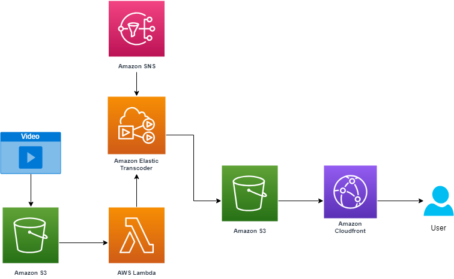
      </p>

## Scenario
If you are looking to encode only a couple of videos  to **HLS** playlist, you could consider converting all videos manually, but if you have a larger library, it is important to replace any manual steps with a good encoding pipeline. **Amazon Elastic transcoder** has all the important components you need to create a transcoding pipeline. 

If you want to streaming your media to global viewers, but afraid of some users may have latency to load your website or media, **CloudFront** can speed up the delivery of your static content. By using CloudFront, you can take advantage of the AWS backbone network and **CloudFront** edge servers to give your viewers a fast, safe, and reliable experience when they visit your website.

Also, it’s important to know is the encoding working or not, so you may like to recieve a notification about the result of the work by using **Amazon Simple Notification Service(SNS)**.


## Pre-requisites
* An AWS account.
* Make sure the region is **US East (N. Virginia)**, which its short name is **us-east-1**.

## Lab tutorial
### Create two S3 buckets for videos
> NOTES: One for the video input, one for output.
1. On the Services menu, select **S3**.

2. Choose **Create Bucket**.

3. For the Bucket Name, type `video-input-firstname(e.g. video-input-jerry)`.

4. For the Region, choose **US East (N. Virginia)**. 

5. Choose **Create**.

<p align = "center">
      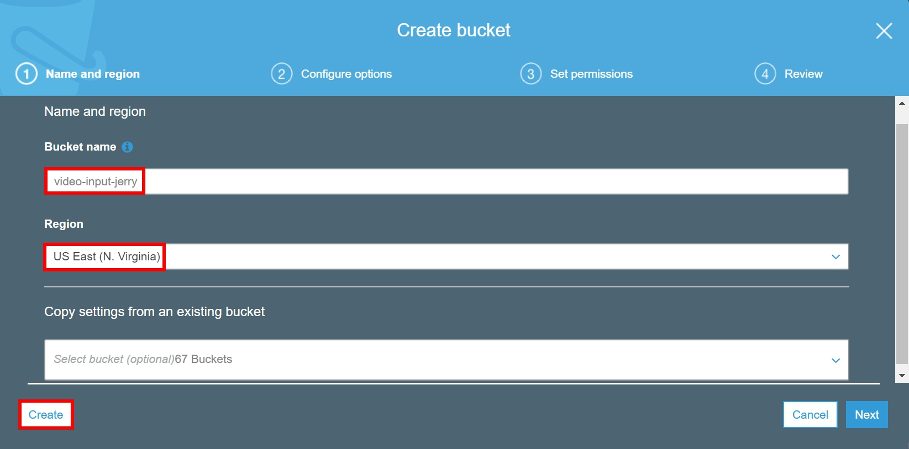
      </p>

6. Repeat step 2~5 to create another bucket, but named it `video-output-firstname(e.g. video-output-jerry)`.

### Set up notifications for the following work
1. On the services menu, select **Simple Notification Service(SNS)**

2. Select **Topics** on the left navigation panel, then choose **Create new topic**.

<p align = "center">
      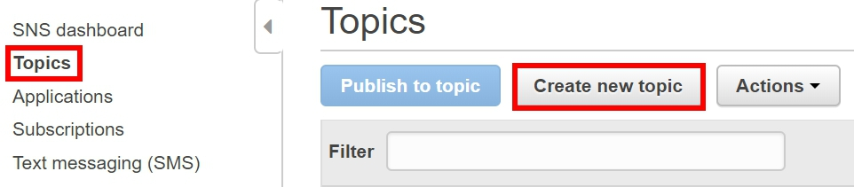
      </p>

3. For the Topic name, type `complete`.

<p align = "center">
      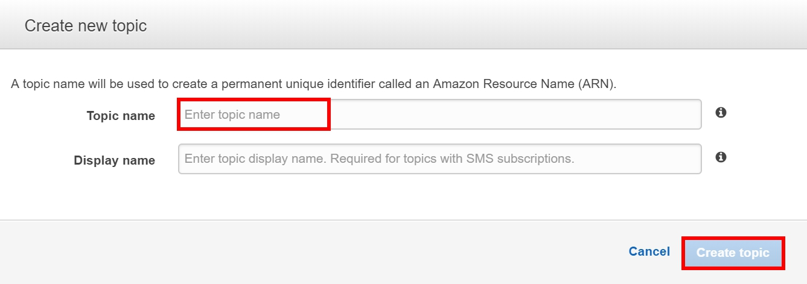
      </p>

4. Repeat step 2, but type `error` for the Topic name.

5. Select one of the topic that you just created, choose **Actions** on the top panel, then choose **Subsribe to topic**.

6. Select **Email** from the **Protocol** drop down list. For **Endpoint**, type `your own email` that you want to recieve the notification of the work status.

<p align = "center">
      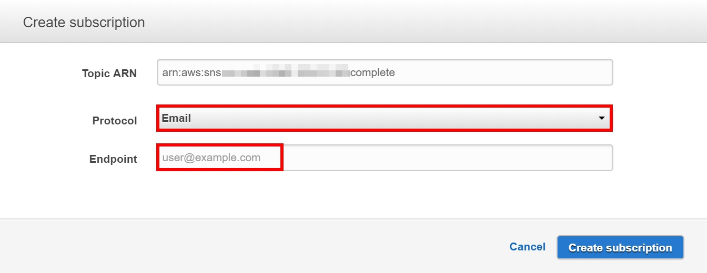
      </p>

7. Select another topic that you haven’t subscribe, then repeat step 5.

8. Go check your email, you should see the mail as following image, choose **Confirm subscription** to confirm for notifications.


<p align = "center">
      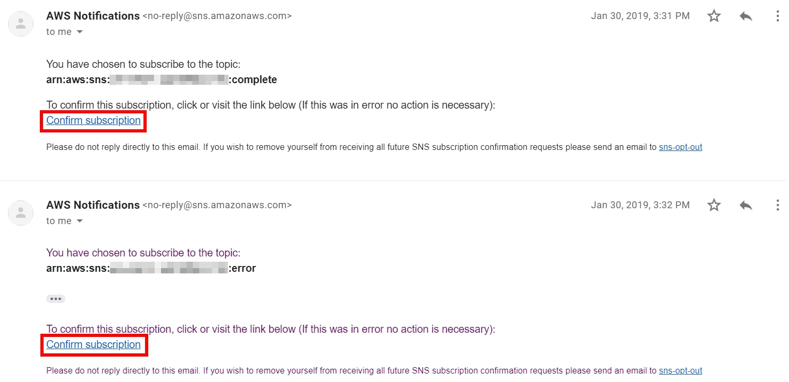
      </p>

### Create a transcoding pipeline

1. On the Services menu, select **Elastic Transcoder**.

2. Select **Pipelines** on the left navigation panel, then choose **Create New Pipeline**.

<p align = "center">
      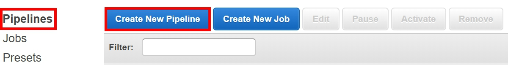
      </p>

3. For the **Pipeline Name**, type `transcode`.

4. For the **Input Bucket**, choose **video_input_firstname** that you created in S3 for input, and leave the **IAM Role** as default.

<p align = "center">
      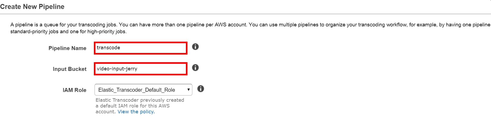
      </p>

5.  For the two buckets that configure for **Transcoded Files and Playlist** and **Thumbnails**, bost choose **video-output-firstname**, and for **Storage Class**, bost choose **Standard**.

<p align = "center">
      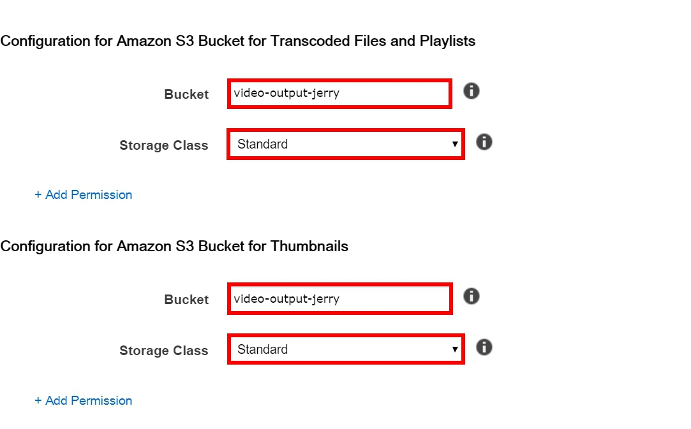
      </p>

6. Expand Notifications on the bottom. For **On Completion Event**, select **Use an existing SNS topic**, then select **complete** for the topic. 

7. For **On Error Event**, select **Use an existing SNS topic**, then select **error** for the topic.

<p align = "center">
      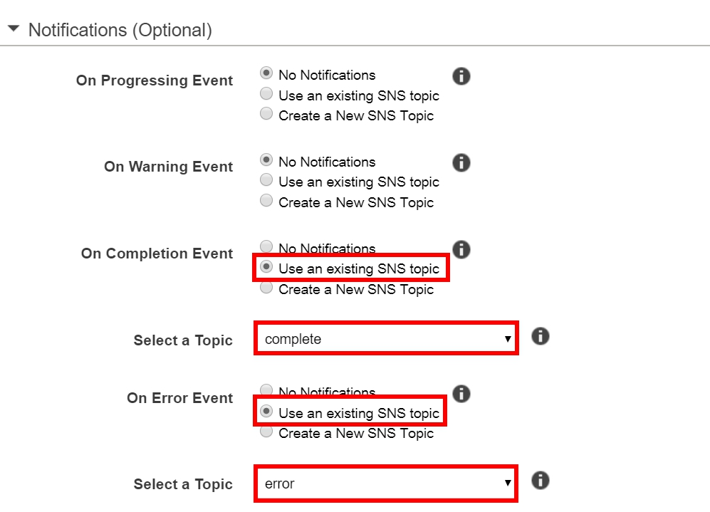
      </p>

8. Leave **Encryption** as default, then choose **Create Pipeline**.

9. You will get a **Pipeline ID** for the pipeline, copy it to your Notepad, we will use it later.

<p align = "center">
      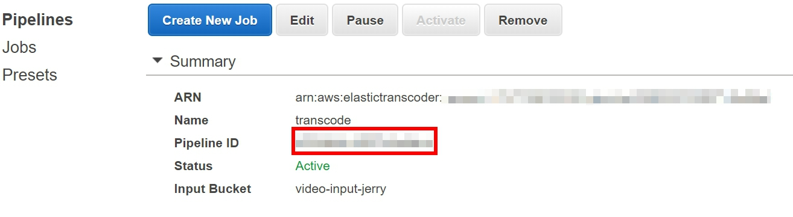
      </p>

### Create IAM Role for Lambda

1. On the Services menu, select **IAM**.

2. Select **Roles** in the left navigation pane, select **Create role**.

3. Choose **Lambda** for the services that will use this role, then choose **Next:Permissions**.

<p align = "center">
      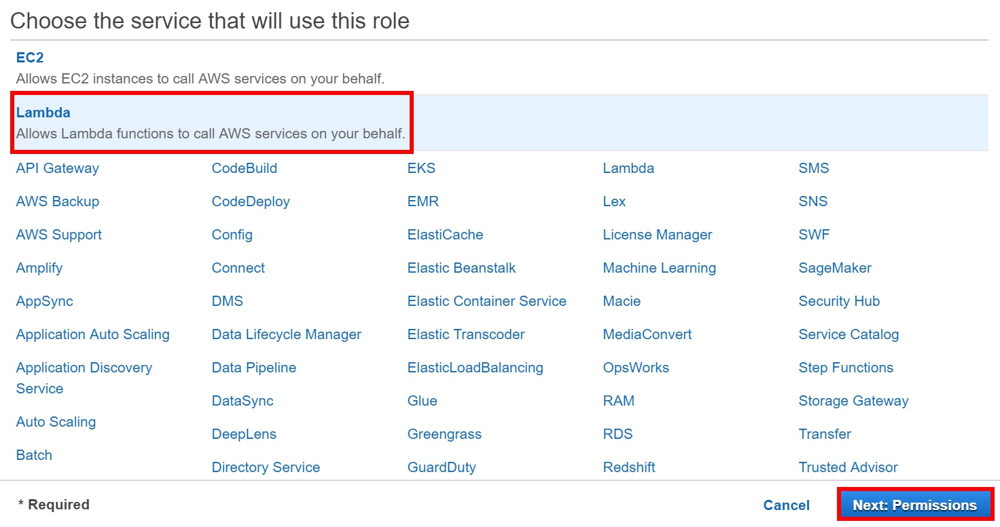
      </p>

4. Search for **AmazonS3FullAccess**, **AmazonElasticTranscoder_FullAccess**, **CloudWatchFullAccess**, **AmazonSNSFullAccess** and select them, then choose **Next: Tags**.

5. For Add tags, choose **Next: Review**.

6. For the **Role name**, type `Lambda_s3_role`, and make sure you select all the policies we need, then choose **Create role**.

<p align = "center">
      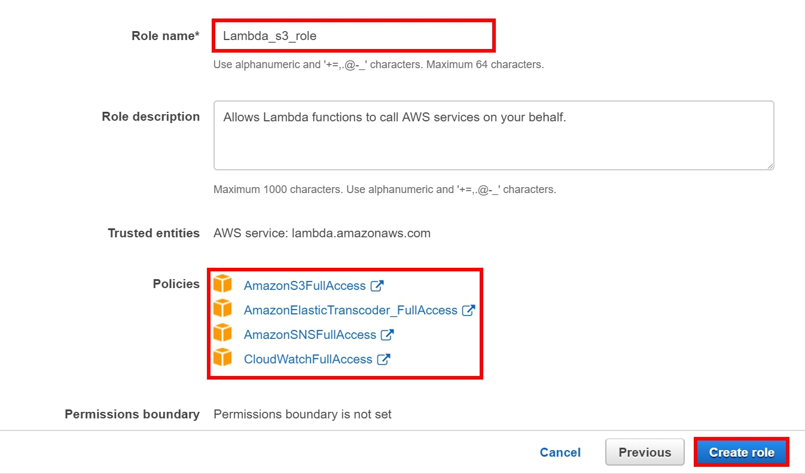
      </p>


### Set up Lambda funtion to trigger Elastic Transcoder

1. On the Services menu, select **Lambda**, then choose **Create Funtion**.

2. Choose __Author from scratch__ for the function.

- Enter the following information, then choose **Create function** :

  - Name : __video_transcode__
  - Runtime : __Node.js 6.10__
  - Role : __Choose an existing role__
  - Existing role : __Lambda_s3_role(the role that you just created)__

<p align = "center">
      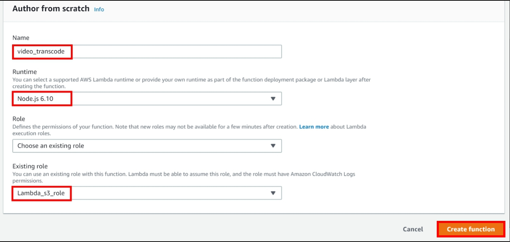
      </p>

3. After creating the lambda function, copy and paste the following code into the Lambda code field **(index.js)**, then replace `<your pipeline id>` with your pipeline id that you copied.

```
var aws = require('aws-sdk');
var elastictranscoder = new aws.ElasticTranscoder();

// return filename without extension
function baseName(path) {
   return path.split('/').reverse()[0].split('.')[0];
}

exports.handler = function(event, context) {
    console.log('Received event:', JSON.stringify(event, null, 2));
    var key = event.Records[0].s3.object.key;
    var outputPrefix = baseName(key) + '-' + Date.now().toString();

    var params = {
      Input: { 
        Key: key
      },
      PipelineId: '<your pipeline id>', 
      OutputKeyPrefix: 'HLS/' + outputPrefix,
      Outputs: [
        {
          Key: '/output/2M',
          PresetId: '1351620000001-200010', // HLS v3 (Apple HTTP Live Streaming), 2 megabits/second
          SegmentDuration: '10',
        },
        {
          Key: '/output/15M',
          PresetId: '1351620000001-200020', // HLS v3 (Apple HTTP Live Streaming), 1.5 megabits/second
          SegmentDuration: '10',
        },
        {
          Key: '/output/1M',
          PresetId: '1351620000001-200030', // HLS v3 (Apple HTTP Live Streaming), 1 megabit/second
          SegmentDuration: '10',
        },
        {
          Key: '/output/600k',
          PresetId: '1351620000001-200040', // HLS v3 (Apple HTTP Live Streaming), 600 kilobits/second
          SegmentDuration: '10',
        },
        {
          Key: '/output/400k',
          PresetId: '1351620000001-200050', // HLS v3 (Apple HTTP Live Streaming), 400 kilobits/second
          SegmentDuration: '10',
        },
        {
          Key: '/output/aud',
          PresetId: '1351620000001-200060', // AUDIO ONLY: HLS v3 and v4 Audio, 160 k
          SegmentDuration: '10',
        }
      ],
      Playlists: [
        {
            Format: 'HLSv3',
            Name:  '/' + baseName(key) + '-master-playlist',
            OutputKeys: [ '/output/2M', '/output/15M', '/output/1M','/output/600k', '/output/400k', '/output/aud']
        }
      ]
    };

    elastictranscoder.createJob(params, function(err, data) {
      if (err) console.log(err, err.stack); // an error occurred
      else     console.log(data);           // successful response
    });
};
```

4. At the upper left of the function, find **Add triggers** and choose **S3**. 

- select the following information, leave **Prefix** and **Suffix** as default, then choose **Add** :

  - Bucket : __video_input_firstname__
  - Event type : __All object create events__

<p align = "center">
      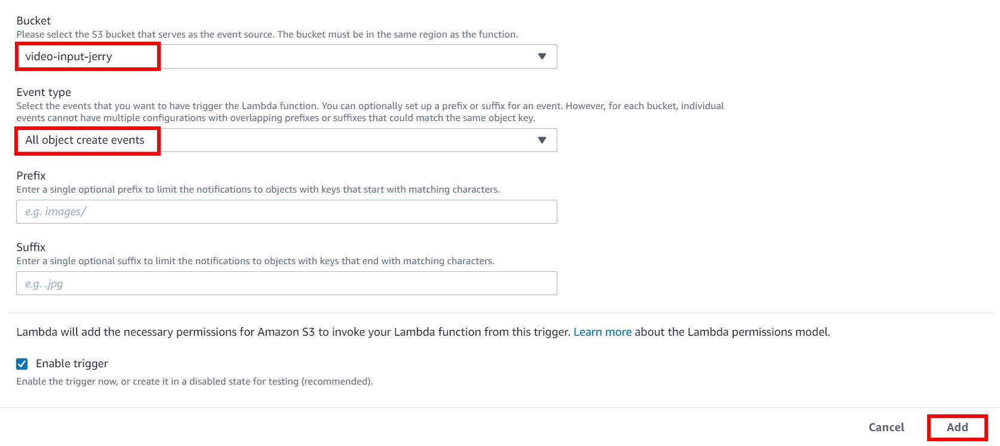
      </p>

5. After you finished the step above, at the upper right of the function, choose **Save**.

### Upload video to S3 for transcoding

1. On the Services menu, select **S3**, and search for the bucket **video_input_firstname** that you created.

2. Upload **test.mp4** to the bucket.

<p align = "center">
      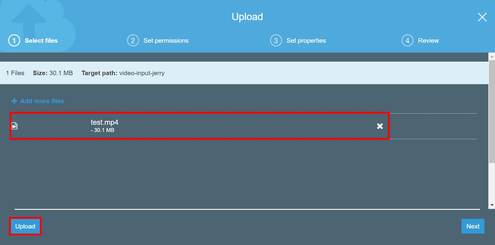
      </p>

3. Wait until the upload finish, and go check your Email that you set for **Simple Notification Service(SNS)**, you should get the notification looks like the following image.

<p align = "center">
      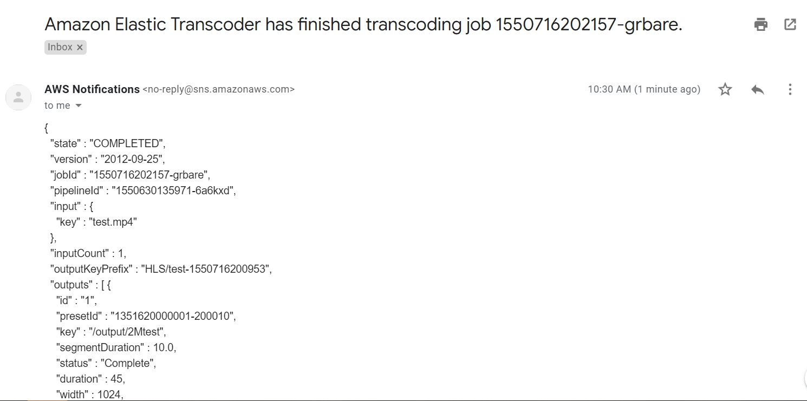
      </p>

4. Now go back to S3 and search and choose **video-output-firstname** that you created, you should see a folder named **HLS**, it should include objects like the following image. 


<p align = "center">
      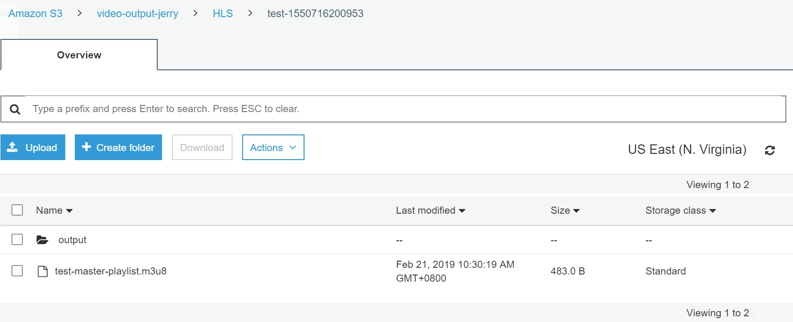
      </p>

5. Select **test-master-playlist.m3u8** and copy the path of this file to your notepad, we will use it later.

<p align = "center">
      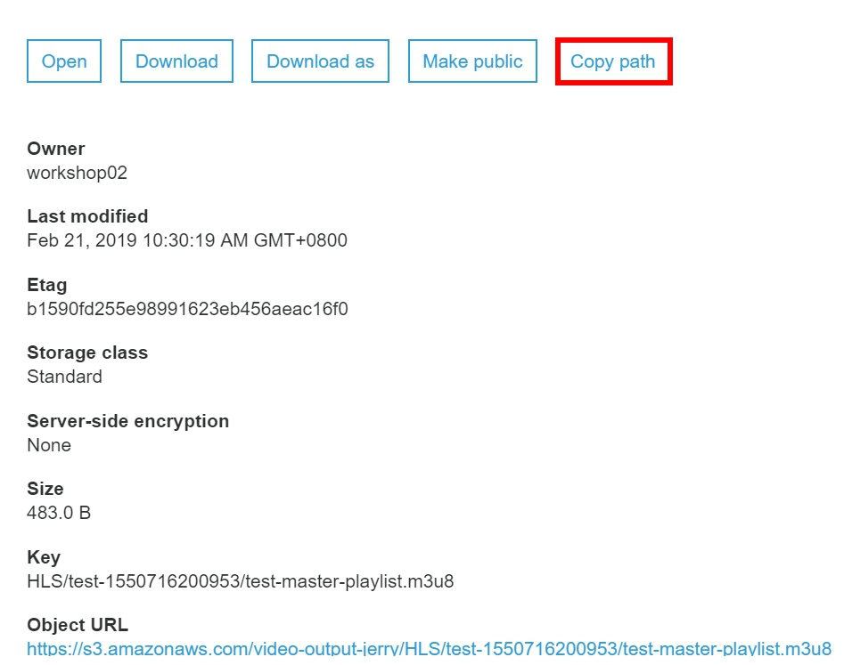
      </p>

### Set up CloudFront for video streaming

1. On the Services menu, select **CloudFront**.

2. Select **Distributions** on the left navigation panel, and choose **Create Distribution**.

3. Select Web for delivery method for your content and choose **Get Started**.

<p align = "center">
      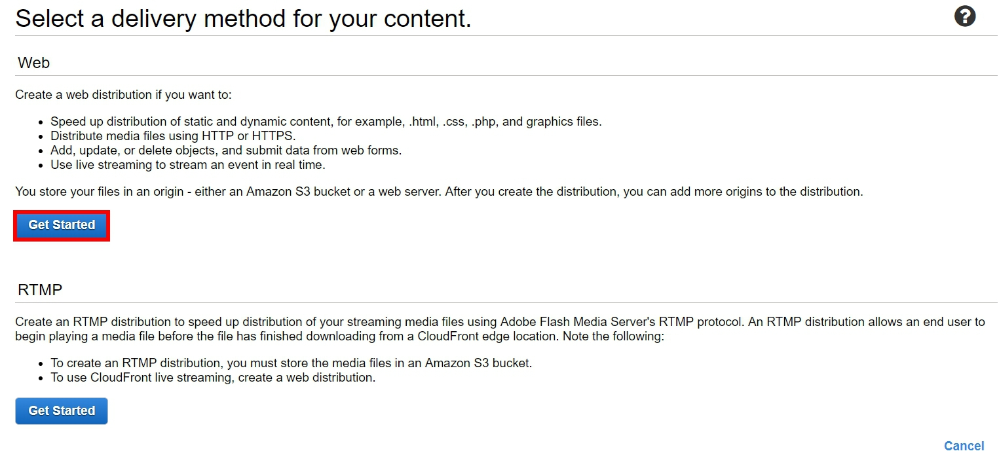
      </p>

4. For Origin Settings, search `video-output-firstname.s3.amazonaws.com` for your Origin Domain Name.
- Then choose the information as the following. 

  - __Restrict Bucket Access__ : Yes
  - __Origin Access Identity__ : Create a New Identity
  - __Grant Read Permissions on Bucket__ : Yes, Update Bucket Policy

<p align = "center">
      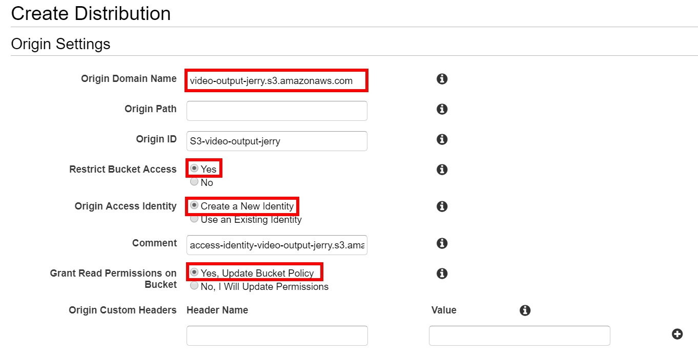
      </p>

5. Leave all other settings as default, and choose **Create Distribution**, it should take about 20 minutes for the distribution to create.

6. Go back to **Distribution** to check the status, after the creating process is finish, select the distribution that you created, copy the **Domain Name** to your notepad and we will use it later.

<p align = "center">
      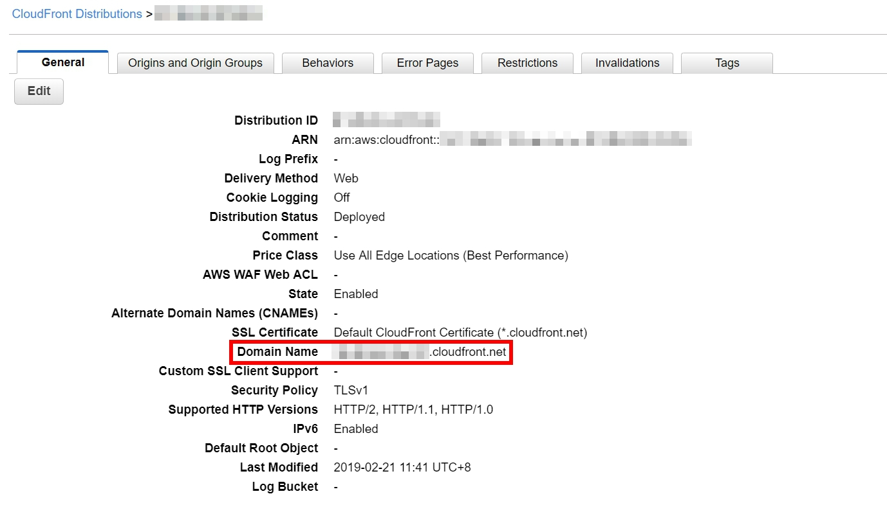
      </p>

### Test video streaming 

1. Now we need a video player to test if we can play the video by the domain name, you can test by your own video player software or download [VLC media player](https://www.videolan.org/) by this link. 

2. After you finish download, open **VLC media player**, choose **Media** and select **Open Network Stream**.

<p align = "center">
      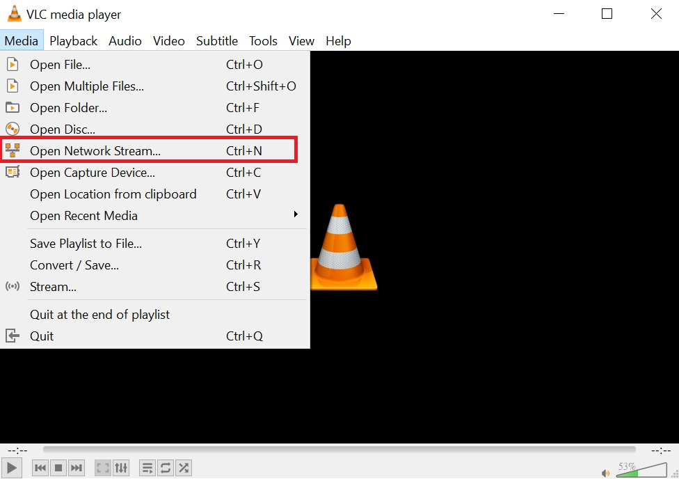
      </p>

3. Type `http://<your domain name>/<your s3 file path>` for the network URL, replace `<your domain name>` by the domain name that you copied, replace `<your s3 file path>` by the file path that you copied, but remove the part **s3://video-output-firstname/** from the file path, then choose **Play**.

<p align = "center">
      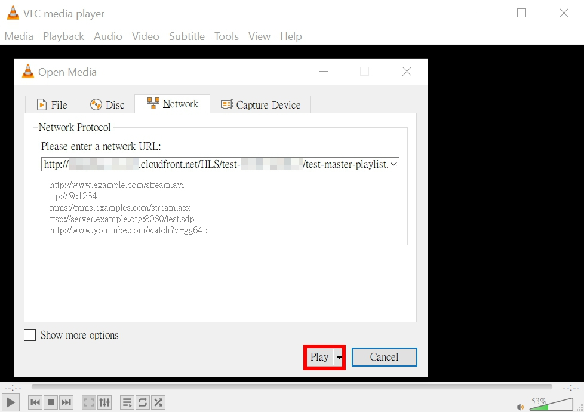
      </p>

4. You should see the video after if all the steps are correct.

<p align = "center">
      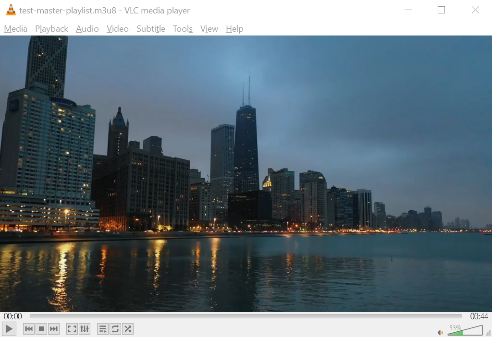
      </p>

## Conclusion

Congratulations! We have learned how to:

- Build a Pipeline for transcoding video
- Create an Lambda application that can transcode video by Elastic Transcoder
- Build a video streaming service by using CloudFront to deliver the content


## Clean Up

- The S3 buckets that you created
- The SNS topics that you created
- The Pipeline in Elastic Transcoder that you created
- The IAM Role that you created
- The Lambda function that you created
- The CloudFront distribution that you created

s